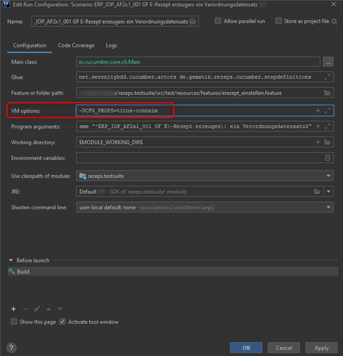

#### Die API-Beschreibung der Komfortsignatur befindet sich [hier](documentation/comfortsignature.adoc).

# Proof of Concept Komfortsignatur
## Überblick

Der Proof of Concept für die Komfortsignatur soll Primärsystem-Herstellern eine Orientierung zur
Implementierung geben. Er umfasst Cucumber Features für
* die wesentlichen Szenarien der Komfortsignatur,
* ein erweitertes Szenario zur Aktivierung der Komfortsignatur, wenn der Sicherheitszustand des HBAs
  bereits erhöht ist

Die Implementierungsbeispiele wurden in Java mittels SpringBoot und JAXB zur Generierung der SOAP-
Nachrichten umgesetzt.

Der aktuelle Stand des PoC ist außerhalb der gematik nicht kompilier- und lauffähig, da 
Maven-Dependencys verwendet werden, die aktuell nur in der gematik geladen werden können und 
benötigte Gegenstellen ggf. nicht verfügbar sind (z.B. ein Konnektor der die Komfortsignatur 
unterstützt).

## Getting started

Um die Client-Schnittstelle des Konnektors für die Komfortsignatur nutzen zu können, werden zunächst
aus den WSDL-Beschreibungen der Schnittstelle mittels JAXB Java-Klassen generiert. Dies erfolgt
währed des Maven Builds. In der Datei rezeps.testsuite/pom.xml kann anhand des Plugins 
org.codehaus.mojo:jaxws-maven-plugin die Konfiguration nachvollzogen werden. Wir weisen auf 
folgende Besonderheit hin: Aktuell verwendet der AuthSignatureService Nachrichten aus dem 
SignatureService, jedoch in einer älteren Version. Daher ist es notwendig die Nachichten des
AuthSignatureService separat zu generieren und vorzuhalten. Wir lösen dies mittels JAXB Bindings. 
Eine detaillierte Beschreibung findet sich weiter unten im Abschnitt "Java-Klassen für den 
AuthSignatureService generieren".

Die Szenarien sind in folgenden Dateien abgelegt:
* rezeps.testsuite/src/test/resources/features/poc_komfortsignatur.feature
* rezeps.testsuite/src/test/resources/features/komfortsignatur_aktivieren.feature

Von dort aus können die Abläufe nachvollzogen werden.

* Die Cucumber-Steps rufen Methoden in der Klasse de.gematik.rezeps.cucumber.stepdefinitions.KonnektorStepDefinitions
  auf
* Die Klasse de.gematik.rezeps.gluecode.KonnektorGlueCode implementiert eine Facade, die Aufrufe an
  den Konnektor kapselt und Response-Daten für den weiteren Test-Verlauf zur Verfügung stellt
* Im nächsten Layer finden sich SpringBeans, welche die Logik eines Aufrufs an den Konnektor
  kapseln. Diese SpringBeans werden jeweils von zwei Klassen unterstützt:

  * *NameDerKonnektorOperation*Configuration: Implementiert das Marshalling / Unmarshalling der
    SOAP-Nachrichten
  * Perform*NameDerKonnektorOperation*: Befüllt die Datenstruktur, die den SOAP-Request
    repräsentiert, sendet diesen und empfängt die Response

## Java-Klassen für den AuthSignatureService generieren 

Das Primärsystem muss beide Versionen des SignatureService unterstützen (v7.4 und V7.5). Die Nachrichten des AuthSignatureService müssen den SignatureService v7.4 verwenden. Daher ist es notwendig, die Nachrichten des AuthSignatureService separat zu generieren und vorzuhalten. In 
diesem PoC lösen wir dies mittes JAXB Bindings wie folgt:

In der Datei rezeps.testsuite/pom.xml sieht man in der Konfiguration des Plugins org.codehaus.mojo:jaxws-maven-plugin, dass in der Execution mit der id general zunächst die Klassen u.a. des SignatureService in der Version V7.5.5 generiert werden. Für den AuthSignatureService gibt es eine separate Execution mit der id auth_signature_service. Hier werden die Klassen für den AuthSignatureService in der Version 7.4.1 generiert. Dabei werden zwei Bindings referenziert:
- authSignatureService_V7_4.jaxws.xjb
- signatureService_V7_4.jaxws.xjb

Diese beiden Bindings liegen im Verzeichnis rezeps.testsuite/src/jaxws. Mittels dieser Bindings wird festgelegt, dass Objekte des AuthSignatureService V7.4.1 und des SignatureService V7.4 in eigene Packages generiert werden, beispielsweise de.gematik.ws.conn.signatureservice.v7_4 für den SignatureService V7.4. Bei der Implementierung ist darauf zu achten, dass entsprechend des Kontextes die Klassen der intendierten Version des SignatureService verwendet werden.

Die nachfolgende Beschreibung richtet sich an die Entwickler:innen der Testsuite:

## Erweiterung der Konnektor-Schnittstelle
Um eine weitere Operation des Konnektors zu nutzen, müssen drei Klassen implementiert werden:
* Eine Spring Boot Configuration, die insbesondere das Marshalling / Unmarshalling von Java-Objekten
  in SOAP-Nachrichten übernimmt (Beispiel: GetCardsConfiguration)
* Eine Klasse, die das Senden der Nachricht und Empfangen der Response umsetzt. Dazu ist die Klasse
  WebServiceGatewaySupport des Framewors Spring Boot zu erweitern (Beispiel: PerformGetCards)
* Eine Spring-Boot-Komponente, welche Logik im Zusammenhang mit der Operation implementiert
  (Beispiel: CardHandleFinder)

Falls die zu unterstützende Funktion in den Umfang eines Konnektor-Dienstes fällt, der bisher nicht
angesprochen wurde, so müssen auch die Java-Klassen aus der entsprechende WSDL generiert werden.
Dazu ist die WSDL, welche die zu unterstützende Funktion enthält, in der POM des Moduls
rezeps.testsuite hinzuzufügen. Der Eintrag wird in der Konfiguration des Plugins jaxws-maven-plugin
unterhalb von wsdlFiles hinzugefügt. Nach dem nächsten Maven-Build stehen die benötigten Klassen
dann zur Verfügung.

## Ausführung der Integrationstests
Im Moduel rezeps.testsuite gibt es einige Integrationstests, die dem Entwickler dazu dienen können
Use Cases und Abläufe durchzuspielen. Erkennbar sind diese Tests am Postfix IntegrationTest im
Klassennamen. Die Integrationstests werden aktuell nicht über die CI ausgeführt, sie erfordern lokal
folgende Voraussetzungen:
* Eine Konnektor-Gegenstelle (z.B. KoPS) ist verfügbar und es ist eine eGK und ein HBA gesteckt
* Die Docker-Umgebung des E-Rezept-Fachdienstes ist gestartet

Da KoPS und der E-Rezept-Fachdienst unterschiedliche Vertrauensräume nutzen, ist es notwendig beim
Einstellen eines Rezeptes das signierte Rezept zu mocken. Das von KoPS signierte Rezept würde vom
E-Rezept-Fachdienst abgelehnt werden. Dazu muss die Umgebungsvariable mockSignedBundle auf true
gesetzt werden.

### Konfiguration der Testsuite

Eine Konfiguration der TestSuite wird über eine entsprechende config.[*].properties gelöst.
Vorgabe hierfür ist die config.properties im Verzeichnis rezeps.testsuite/src/test/resources/.

Es besteht die Möglichkeit diese zu überschreiben. Hierzu ist eine entsprechende Konfiguration nach 
dem Muster config.<name>.properties zu erstellen. Um diese angepasste andere Konfiguration ausführen 
zu können, kann der Parameter "**CFG_PROPS**" verwendet werden. Bsp.:

*Diese Konfigurationsdatei beinhaltet:* 

konnektor_ip= IP Adresse des Konnektors 
konnektor_port= Port 
konnektor_**_service_endpoint=  Entsprechenden Service Endpunkt des Konnektors 

path_to_client_keystore=src/test/resources/kops-client-keystore.p12 
client_keystore_password= Kennwort 
path_to_client_truststore=src/test/resources/kops-client-truststore.p12 
client_truststore_password=Kennwort 

idp_discovery_url= Url des IDP Discovery Dokuments 
idp_redirect_url= Redirekt Url 
idp_client_id=gematikTestPs (Klient ID) 
